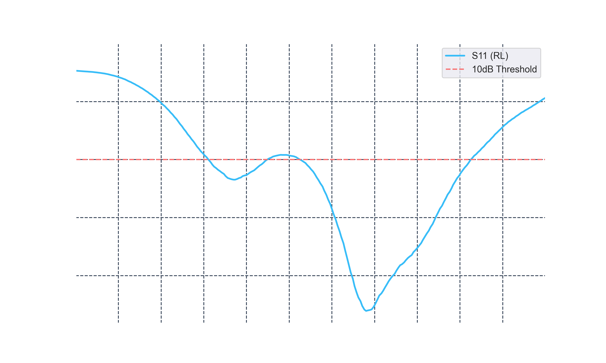
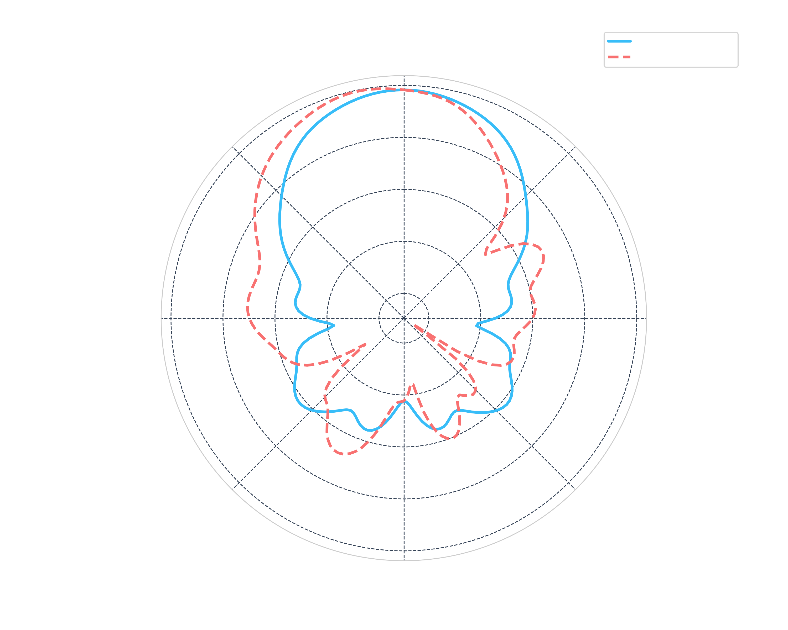

🛰️ Radar Antenna Analysis & RF Signal Processing

Core Skillset:
**Python** | **Pandas** | **Matplotlib** | **Data Engineering** | **RF Theory**
📌 Project Overview

This repository serves as a bridge between my experience in automotive sensor data and my experience in RF - electromagnetics. It demonstrates the ability to handle domain-specific data formats (like S-parameters and gain plots) and transform raw measurements into industry-standard visualizations.

### 🛠️ Key Technical Features

1. **Data Ingestion & Cleaning:**
   * **Parsing** complex CSV files with nested metadata (Author/Equipment headers).
   * **Automated unit conversion** ($Hz \rightarrow GHz$) and rounding for high-precision radar datasets.

2. **Engineering Visualization:**
   * **Return Loss Analysis:** Plotting $S_{11}$ resonance with inverted Y-axes to highlight impedance matching at **77 GHz**.
   * **Radiation Patterns:** Comparative Polar plots for **E-plane** ($\phi = 0^{\circ}$) and **H-plane** ($\phi = 90^{\circ}$) analysis.

3. **Automated Insights:**
   * **Programmatic identification** of resonance frequencies using `idxmin()` logic.
   * **Dynamic annotation** of "Dips" and "-10dB Thresholds" for bandwidth verification.

### 📊 Sample Results

#### 1. Return Loss (RL)

*This plot identifies a sharp resonance at 76.8 GHz, indicating optimal antenna tuning for automotive radar applications.*

#### 2. 2D Polar Radiation Pattern

*Comparative analysis of the antenna's beamwidth and side-lobe levels across two principal planes.*

#### 📈 Current Learning Roadmap (To-Be Acquired)

  [ ] Signal Smoothing: Implementing Savitzky-Golay filters via scipy.signal to handle noisy real-world VNA sweeps.

  [ ] Automated Bandwidth Calculation: Scripting the "Search for -10dB intercept" to calculate fractional bandwidth automatically.

  [ ] Interactive Dashboards: Converting static plots to Plotly for interactive frequency exploration.

📂 Repository Structure

  /data: Raw CSV/S1P files (cleaned of sensitive metadata).

  /notebooks: Jupyter notebooks

  /exports: High-resolution, transparent PNGs for technical reports.

#### 🚀 Replication
Follow these steps to set up the environment and run the analysis locally:

1. Clone the repository
Bash

git clone https://github.com/montahabouezzed-sys/RF-Signal-Processing-Antenna-Analysis.git
cd RF-Signal-Processing-Antenna-Analysis

2. Install dependencies
Bash

pip install pandas matplotlib numpy

3. Run the Analysis
Navigate to the /notebooks directory and open the .ipynb files using Jupyter Lab or VS Code.

